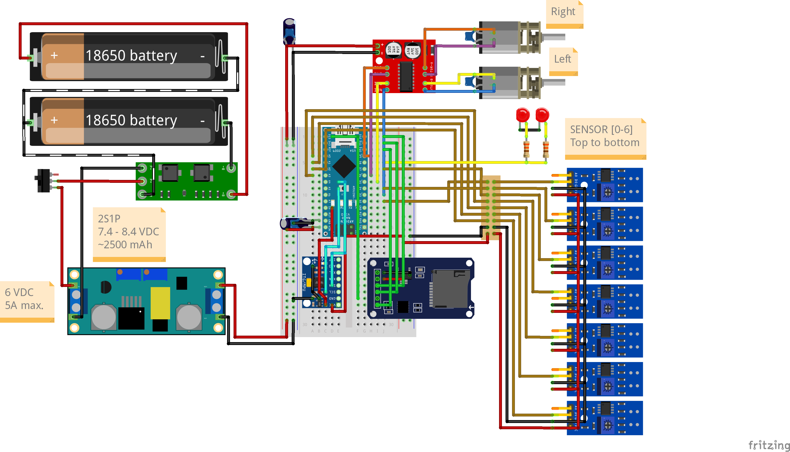

# CoRA 2025 (Autonomous Robot Competition) - Line Follower

 This repository contains all files used in the development and testing of our autonomous line-follower robot for the 2025 CoRA competition. The challenge involves prototyping, building, programming, and testing a robot from scratch, utilizing tools such as the Arduino Framework, CAD software, and circuit simulation.

## Technical Overview

Our 2025 project, themed after the Teenage Mutant Ninja Turtles (TMNT) cartoon, is a complete redesign focusing on precision and efficient movement, prioritizing accuracy and robust challenge handling over raw speed. The robot integrates custom-designed hardware, efficient control software, and an optimized mechanical design.

### 1. Programming & Control

The robot's control system is built on the Arduino framework, using C++ for real-time motor control, sensor data processing, and navigating the track's challenges.

#### Code File Structure
- `miscellaneous/`: Directory containing media files like images, diagrams, and CAD renders.
- `pdfs/`: Contains official competition documents for reference, code documentation, and other important project files.
- `CoRA2025.ino` & `CoRA2025.h`: The main Arduino sketch and its header file. They contain the `setup()` and `loop()` functions, orchestrating the robot's high-level logic.
- `motors.cpp` & `motors.h`: Module responsible for low-level motor control (forward, backward, turn, stop).
- `challenges.cpp` & `challenges.h`: Implements the high-level logic for handling specific track challenges like curves, intersections, and line recovery.
- `constants.cpp` & `constants.h`: Centralizes all global constants, such as pin assignments, PID gains, and state variables.
- `plot_log.py`: A Python script used to read, analyze, and plot the log data generated by the robot and saved to an SD card.

#### Languages & Frameworks
- [Arduino / C++](https://www.arduino.cc/): Main Embedded Framework
- [C](https://learn.microsoft.com/en-us/cpp/c-language/): Core libraries and implementations
- [Python](https://python.org): Data Analysis, plotting and script-based testing

### 2. Electronics & Hardware

<a href="miscellaneous/CoRA2025_ElectronicDiagram_V1.3.png">
  
</a>

A schematic of the electronic circuitry used in the robot.

#### Key Components
- **Power Source:**
2x [18650 Lithium-ion battery cells](https://secondlifestorage.com/index.php?threads/eve-icr18650-26v-cell-specifications.8390/1) in 2S1P configuration, regulated by 1x [Balanced BMS for 2S configuration](https://shopee.com.br/Placa-Bms-2s-20A-de-Carregamento-para-2-Baterias-de-3.7V-sendo-2S-7-4V-Balanceada-i.413370384.22793672407).
Regulated to 6V by a [Buck converter](https://www.eletrogate.com/modulo-regulador-de-tensao-step-down-xl4005-conversor-dc-dc-5a).
- **Microcontroller:** 1x [Arduino Nano](https://store.arduino.cc/products/arduino-nano)
- **Motor Driver:** 1x [Mini L298N Motor Driver](https://www.eletrogate.com/mini-ponte-h-dupla-l298n)
- **Motors:** 2x [N20 6V DC Motors with 100rpm, 200:1 gear ratio](https://shopee.com.br/GA12-N20-DC-3V-6V-12V-Motor-De-Redu%C3%A7%C3%A3o-De-Engrenagens-Micro-Tipo-M%C3%BAltiplo-Baixa-Velocidade-Desacelera%C3%A7%C3%A3o-15RPM-600RPM-100RPM-1000RPM-i.780873846.24200559684?xptdk=86665fb1-2630-4398-8e67-c957986a3de1)
- **Wheels:** 2x Custom PLA 3D Printed Wheels with [Serrated Kevlar/Rubber Belt](https://shopee.com.br/Correia-Gt2-6mm-Passo-2mm-impressora-3D-Ender-3-Pro-V2-i.333628117.15734284810) Tires
- **Sensors:** 7x [TCRT5000 Infrared Sensor Module](https://www.eletrogate.com/modulo-seguidor-de-linha-tcrt5000)
- **Chassis:** Custom PLA 3D Printed Arrangement

*(Links referring to the general components' specification, oficial webstores or local webstores where they were acquired in Brazil)*
### 3. Mechanical Design & Structure

The robot's chassis and body were designed in [Fusion 360](https://www.autodesk.com/products/fusion-360/overview) and [SolidWorks](https://www.solidworks.com/product/solidworks-3d-cad) to be lightweight, durable, and provide optimal sensor positioning.

A render of the complete robot assembly.

The technical drawing files for the chassis and other components can be found in the <a href="miscellaneous/">miscellaneous directory</a>. Key design files include:

<ul>
  <li><a href="miscellaneous/chassis_top.pdf">Top Chassis Drawing</a></li>
  <li><a href="miscellaneous/chassis_bottom.pdf">Bottom Chassis Drawing</a></li>
  <li><a href="miscellaneous/motor_mount.pdf">Motor Mount Drawing</a></li>
</ul>

## Awards & Achievements

In the 2025 edition of the CoRA competition, our team was honored to receive the following awards:

* **3rd Place🥉 - Advanced Line Follower Category**
* **1st Place🥇 - Best Design**

<a href="https://www.youtube.com/watch?v=5dsM9JK7ZyI">
  
  
</a>

This video showcases our robot's performance during the rounds of the competition.

## Developers

<table>
  <tr>
    <td align="center" style="max-width: 200px;">
      <a href="https://github.com/lemosslucas" target="_blank">
        
      </a>
       
      <a href="https://github.com/lemosslucas"><strong>Lucas Lemos Ricaldoni</strong></a> 
      Team Lead & Lead Programmer
    </td>
    <td align="center" style="max-width: 200px;">
      <a href="https://github.com/mateusdcp13"> 
        
      </a>
       
      <a href="https://github.com/mateusdcp13"><strong>Mateus de Carvalho Pedrosa</strong></a> 
      Hardware Lead & Prototyping Specialist
    </td>
    <td align="center" style="max-width: 200px;">
      <a href="https://github.com/PauloMendesPVRM"> 
        
      </a>
       
      <a href="https://github.com/PauloMendesPVRM"><strong>Paulo Vasconcelos Mendes</strong></a> 
      Lead Mechanical Designer & Support Prototyper
    </td>
  </tr>
</table>

### Team Name: "Tartarugas Linhas"

## License
This project is licensed under the MIT License. See the [LICENSE](LICENSE) file for details.